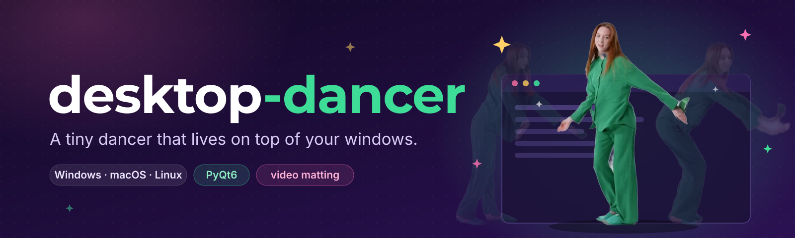
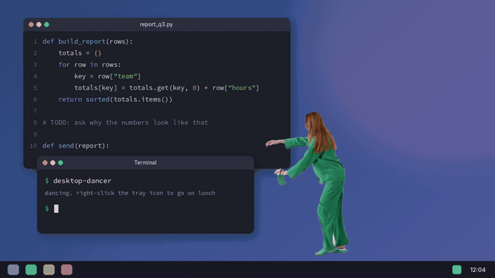

<div align="center">
  

  <br/>

  <a href="https://github.com/gabeparra/desktop-dancer/releases/latest"></a>
  
  
  
</div>

A real dancer, background removed, looping on top of your windows. Step away and she turns into a full-screen "I'M ON LUNCH" sign.

<p align="center"></p>

## Quick start

**Windows:** grab `desktop-dancer.exe` from the [latest release](https://github.com/gabeparra/desktop-dancer/releases/latest) and double-click it.

**macOS / Linux:**

```bash
git clone https://github.com/gabeparra/desktop-dancer.git
cd desktop-dancer
pip install PyQt6
python desktop_dancer.py
```

Drag to move, scroll to resize, middle-click for click-through, right-click (or the tray icon) for the menu.
Going to lunch? `desktop-dancer --lunch "back at 1pm" --timer 1h`, or install `desktop-dancer.scr` from the release as your Windows screensaver.

## Bring your own dancer

Any animated WebP or GIF works: `python desktop_dancer.py my_dance.webp`.

To cut one from a video you shot or have the rights to, [Robust Video Matting](https://github.com/PeterL1n/RobustVideoMatting) removes the background (needs an NVIDIA GPU and ffmpeg):

```bash
pip install torch torchvision numpy
ffmpeg -i source.mp4 -vf scale=1280:720 -an -c:v ffv1 src.mkv
python rvm_to_webp.py src.mkv my_dance.webp 1280 720 25 0 15   # w h fps start seconds
```

Blurry edges? Add `--backbone resnet50`. See-through or blocky dancer? Tune `--alpha-low` / `--alpha-high`.

## Credits

The bundled dancer is "Woman Wearing Sleepwear Dancing" by [cottonbro studio](https://www.pexels.com/video/9499408/) on Pexels, used under the [Pexels License](https://www.pexels.com/license/). Code is [MIT](LICENSE). Changes are in the [changelog](CHANGELOG.md).
